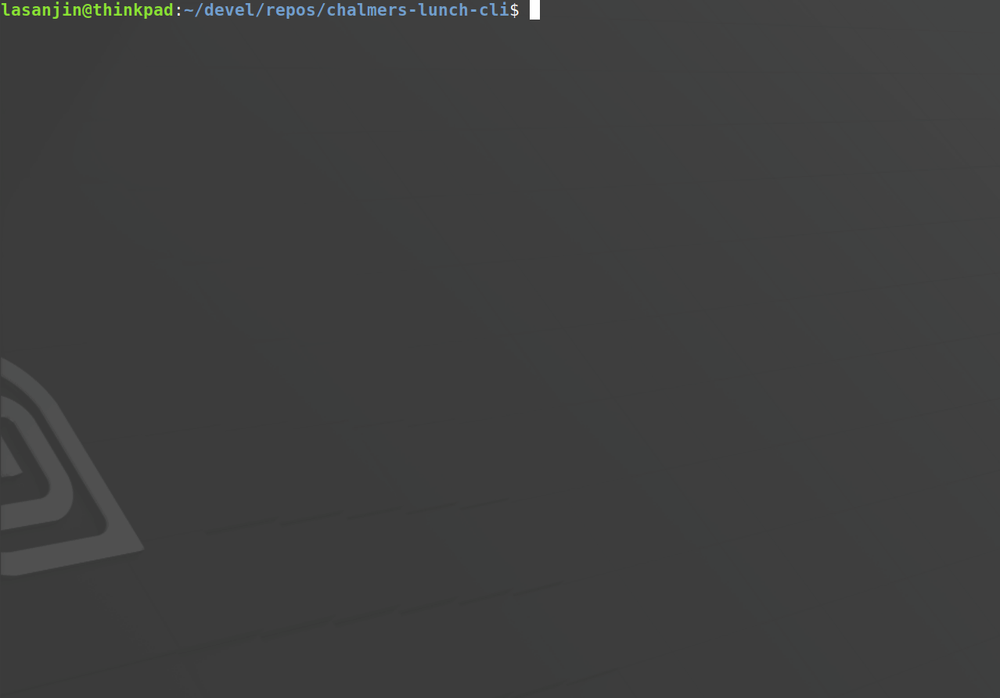

## Description
Outputs Chalmers *Johanneberg*
- Expressen
- Kårrestaurangen
- Linsen
- S.M.A.K
- J.A. Pripps
  
lunch menu in terminal & highlights *Köttbullar*



## Install
```
curl "https://raw.githubusercontent.com/lasanjin/expressen-lunch-cli/master/expressen.py" | bash
```

## How to run
```
express
```

- `$1`
  -  *optional* 
  -  number of days from today, default is today's menus
     -  input `0-9`


## [Linux](resources/README.md)
Open link for instructions on how to run bash script [*expressen.sh*](bash/expressen.sh)