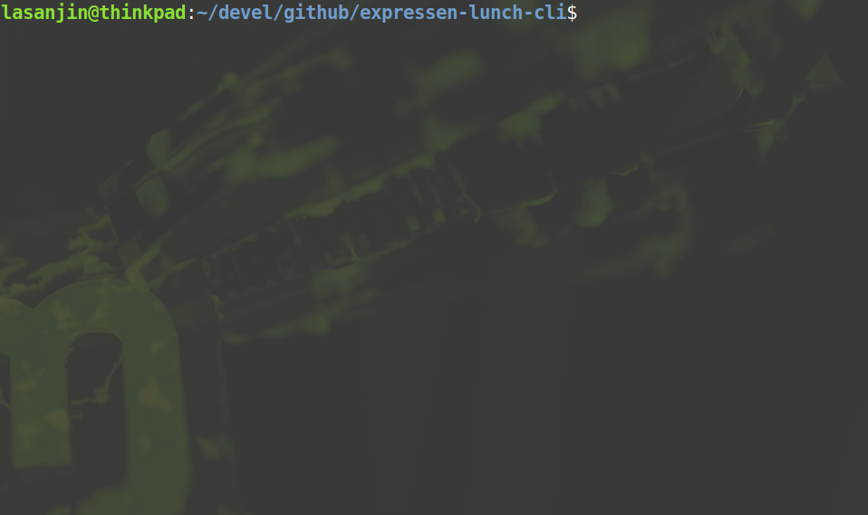

## Description
Outputs Chalmers expressen lunch in terminal & highlights "Meatballs" or "Köttbullar". 



## Get jq
Alt 1
1. Install jq
```
$ sudo apt-get install jq
```

Alt 2
1. Download jq
```
$ wget https://github.com/stedolan/jq/releases/download/jq-1.6/jq-linux64
```
2. Make script executable
```
$ sudo chmod +x ./jq-linux64.sh 
```
3. Replace `jq` with `./jq-linux64` in `expressen_data()` function


## How to run
1. Make script executable
```
$ sudo chmod +x ./expressen.sh 
```

2. Run script
```
$ ./expressen.sh $1 $2
```
- `$1`
  -  *optional* 
  -  #days from today
     -  input `0-9`, default is today's menu
- `$2` 
  - *optional*
  - language
    - input `en` for English menu, default is Swedish