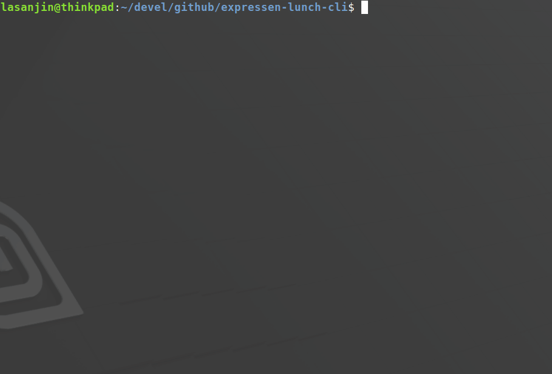

# Expressen Lunch CLI
Gets, maps, sorts & outputs Chalmers Expressen lunch menu ([API](https://chalmerskonferens.se/en/api/)) in terminal and highlights *Köttbullar* as default. 

## Demo



## How to run
```
$ ./expressen.sh $1 $2 $3
```
- `$1`
  -  *Optional*
  -  Number of days (Default is today's menu)
     -  `0-9`
- `$2`
  - *Optional*
  - *Requires* `$1`
  - Language (Default is Swedish)
    - `en` for English menu 
- `$3`
  - *Optional*
  - *Requires* `$2`
    - `en` or `a-z` for Swedish
  - Ingredient to highlight
    - `a-z`
    - Example
      - `potatis`
      - `rice`
  - Case insensitive
  - Exact match
    - If input is `potatis`, it will match `potatis` and not `potatismos`

